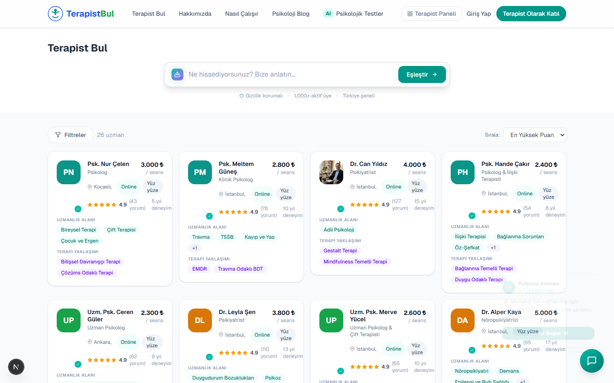
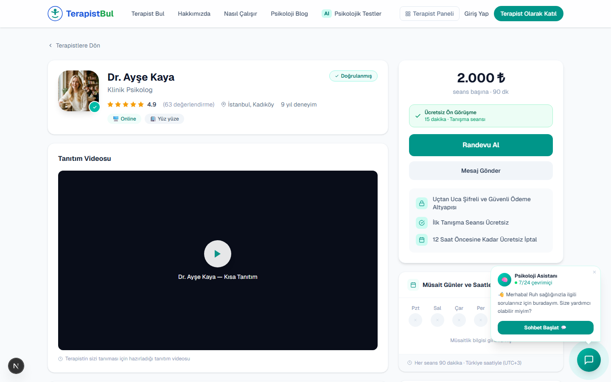
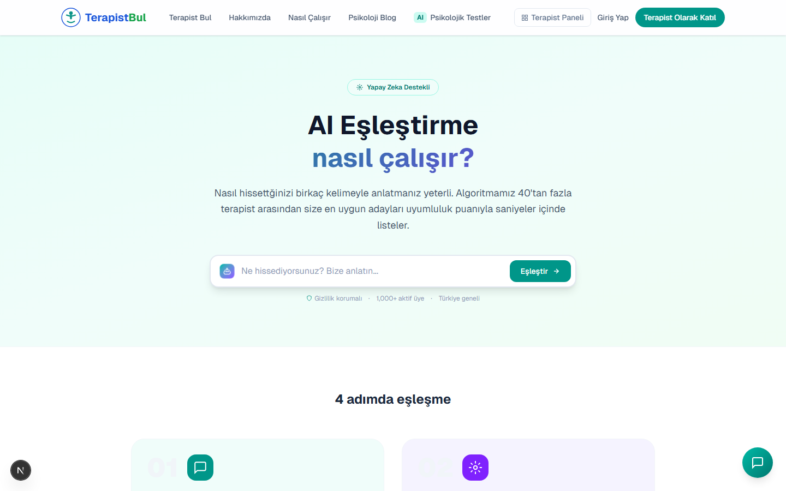
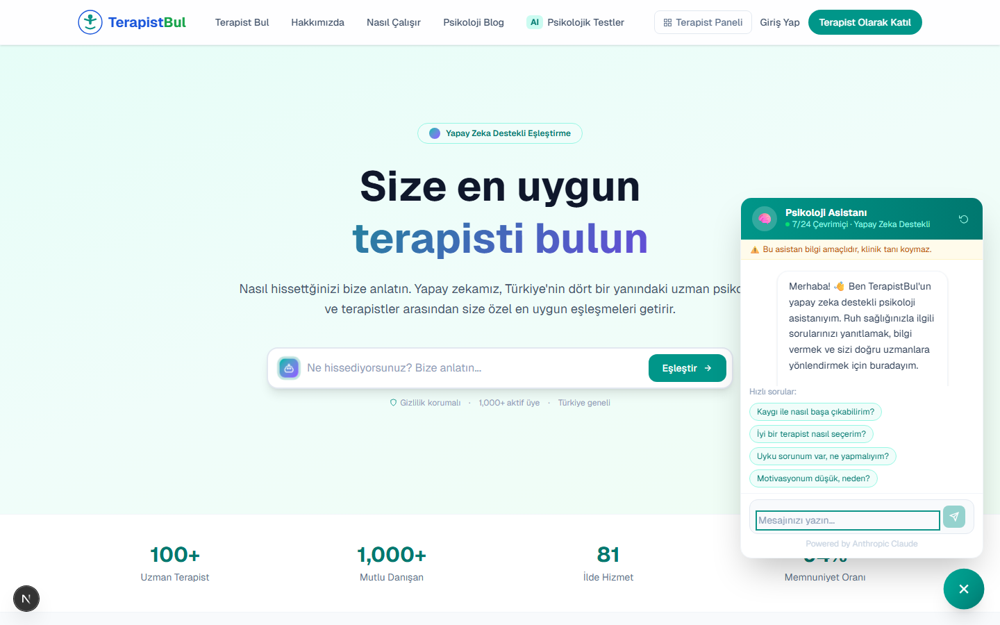
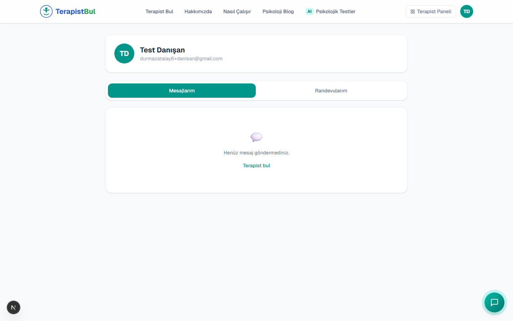
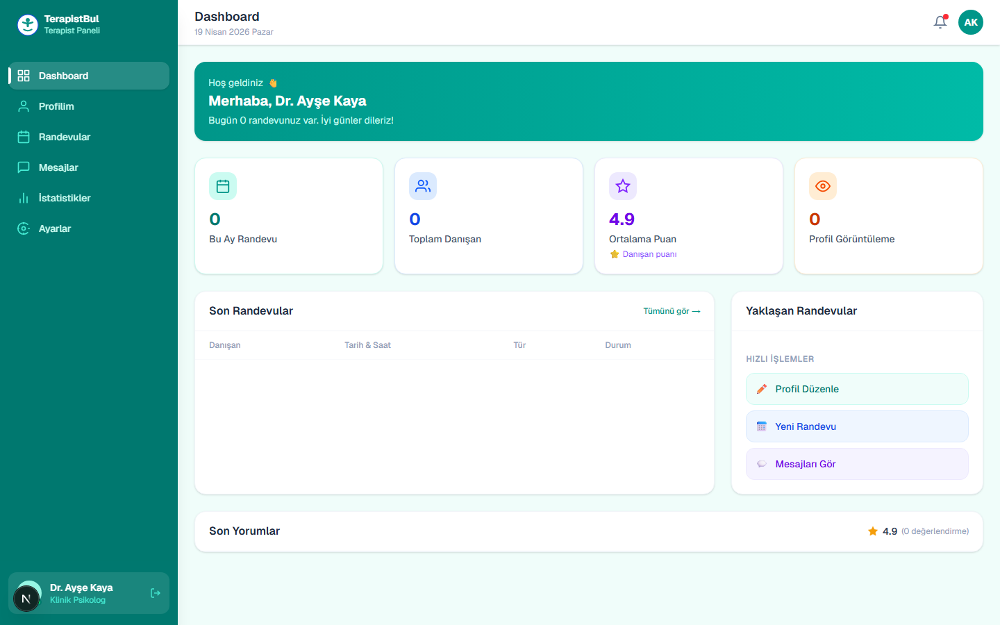
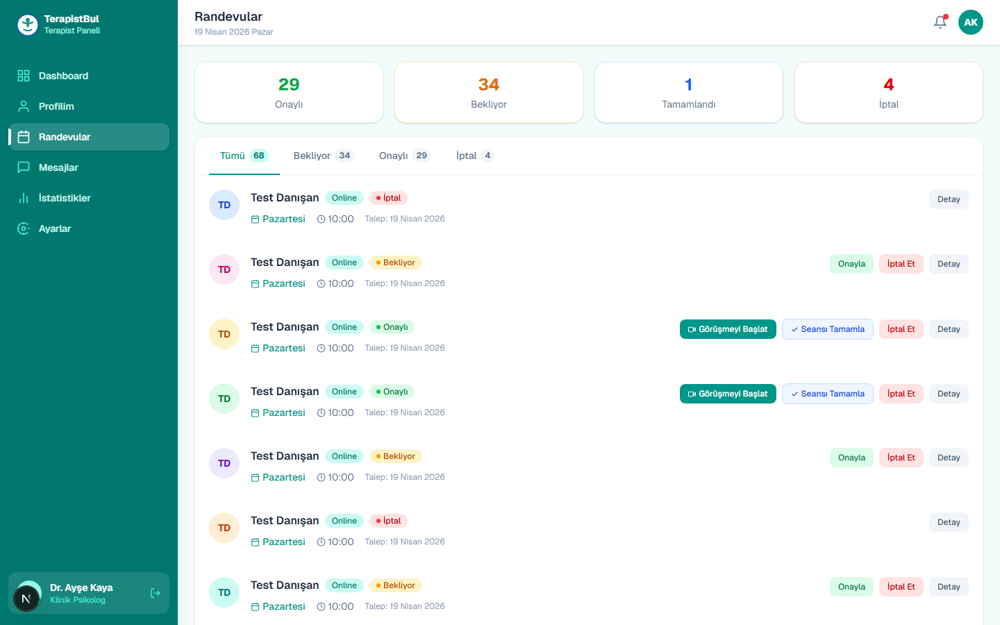
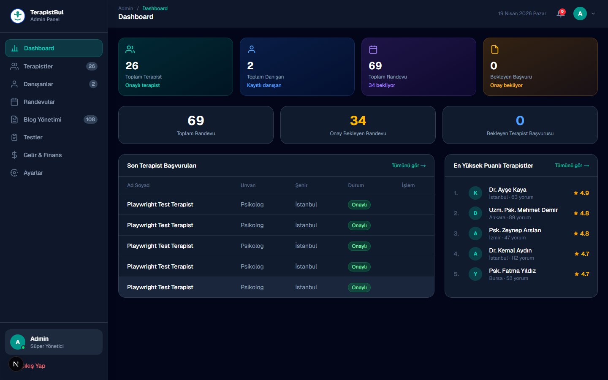
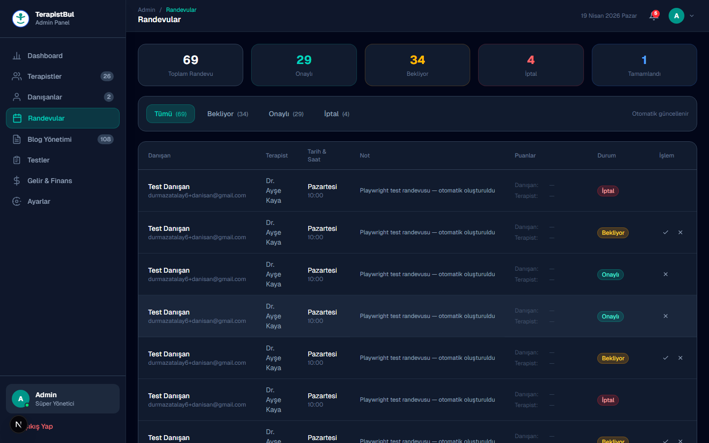

<h1 align="center">🩺 TerapistBul</h1>

<p align="center">
  <strong>Yapay zekâ destekli terapist eşleştirme ve video terapi platformu</strong>
</p>

<p align="center">
  Danışanları ihtiyaçlarına uygun uzmanlarla buluşturur · Güvenli video görüşme altyapısı sunar · 7/24 AI psikoloji asistanı barındırır
</p>

<p align="center">
  <a href="https://terapistbul.com"></a>
  <a href="https://terapistbul.vercel.app"></a>
  
  
  
</p>

<p align="center">
  
</p>

---

## ✨ Öne Çıkan Özellikler

- 🧠 **AI Eşleştirme** — Danışanın anlatımını Claude ile analiz edip en uygun uzmanı önerir
- 💬 **7/24 Psikoloji Asistanı** — Anthropic Claude tabanlı empatik, güvenli sohbet
- 📅 **Randevu Akışı** — Danışan talep eder → Terapist onaylar → Daily.co odası anında üretilir
- 🎥 **Video Terapi** — Daily.co ile şifreli 1-1 görüşme, oda otomasyonu
- 🔄 **Gerçek Zamanlı Sync** — Supabase Realtime ile admin/terapist/danışan panelleri arasında anlık durum güncellemesi
- 🔐 **HMAC İmzalı Oturum** — HTTP-only cookie + Edge-uyumlu middleware ile yetkilendirme
- 📧 **E-posta Bildirimleri** — Resend üzerinden onay/booking bildirimleri
- 🧪 **60+ E2E Test** — Playwright ile uçtan uca senaryo kapsaması

---

## 📸 Ekran Görüntüleri

### Danışan Tarafı

<table>
  <tr>
    <td><strong>Anasayfa</strong><br/></td>
    <td><strong>Terapist Listesi</strong><br/></td>
  </tr>
  <tr>
    <td><strong>Terapist Detay</strong><br/></td>
    <td><strong>AI Eşleştirme</strong><br/></td>
  </tr>
  <tr>
    <td><strong>Psikoloji Asistanı (ChatBot)</strong><br/></td>
    <td><strong>Hesabım</strong><br/></td>
  </tr>
</table>

### Terapist Paneli

<table>
  <tr>
    <td><strong>Dashboard</strong><br/></td>
    <td><strong>Randevular</strong><br/></td>
  </tr>
</table>

### Admin Paneli

<table>
  <tr>
    <td><strong>Dashboard</strong><br/></td>
    <td><strong>Randevular</strong><br/></td>
  </tr>
</table>

---

## 🛠️ Teknoloji Yığını

| Katman | Kullanılan |
|---|---|
| **Framework** | Next.js 16 (App Router) · React 19 |
| **Stil** | Tailwind CSS |
| **Veritabanı** | Supabase (Postgres + Realtime) |
| **Kimlik** | NextAuth v5 (credentials + Google) + HMAC imzalı cookie |
| **Yapay Zekâ** | Anthropic Claude (chat & eşleştirme) |
| **Video** | Daily.co API |
| **E-posta** | Resend |
| **Test** | Playwright E2E |
| **Deploy** | Vercel |

---

## 🚀 Yerel Kurulum

```bash
# 1. Depoyu klonla
git clone https://github.com/Atalaydurmaz/terapistbul.git
cd terapistbul

# 2. Bağımlılıkları yükle
npm install

# 3. Ortam değişkenlerini oluştur
cp .env.example .env.local

# 4. Geliştirme sunucusunu başlat
npm run dev
```

Uygulama `http://localhost:3000` (veya konfigüre edilen portta) ayağa kalkar.

### Gerekli Ortam Değişkenleri

```env
# Supabase
NEXT_PUBLIC_SUPABASE_URL=
NEXT_PUBLIC_SUPABASE_ANON_KEY=
SUPABASE_SERVICE_ROLE_KEY=

# NextAuth
NEXTAUTH_URL=http://localhost:3000
NEXTAUTH_SECRET=

# Google OAuth (opsiyonel)
GOOGLE_CLIENT_ID=
GOOGLE_CLIENT_SECRET=

# Anthropic Claude
ANTHROPIC_API_KEY=

# Daily.co
DAILY_API_KEY=
DAILY_DOMAIN=terapistbul

# Resend
RESEND_API_KEY=
CONTACT_EMAIL=

# Admin demo hesabı
ADMIN_EMAIL=admin@terapistbul.com
ADMIN_PASSWORD=
```

---

## 🔑 Demo Hesapları

| Rol | E-posta | Şifre |
|---|---|---|
| Admin | `admin@terapistbul.com` | `admin123` |
| Terapist (statik) | `ak@terapistbul.com` | `123456` |

---

## 🧪 Testler

```bash
# Tüm E2E testlerini çalıştır
cd tests
npx playwright test

# Belirli bir dosyayı çalıştır
npx playwright test 05-deep-integration.spec.js

# HTML rapor aç
npx playwright show-report
```

Test kapsaması:
- `01-admin-panel.spec.js` — Admin yetkilendirme ve CRUD
- `02-therapist-panel.spec.js` — Terapist paneli akışları
- `03-client-booking.spec.js` — Danışan kaydı, giriş, rezervasyon
- `04-sync-verification.spec.js` — Admin/terapist/danışan arası sync doğrulama
- `05-deep-integration.spec.js` — Komple rezervasyon döngüsü, Daily.co, Realtime, ChatBot

---

## 🏗️ Mimari

```
src/
├── app/                      # Next.js App Router
│   ├── api/                  # Route handlers
│   ├── admin/                # Admin paneli
│   ├── panel/                # Terapist paneli
│   ├── hesabim/              # Danışan hesabı
│   └── terapist/[id]/        # Terapist detay
├── components/               # Paylaşılan UI
├── lib/
│   ├── auth/session.js       # HMAC imzalı cookie (Edge uyumlu)
│   └── supabase/             # Browser / Server / Admin client
├── hooks/
│   └── useRealtimeTable.js   # Supabase Realtime aboneliği
└── middleware.js             # /admin ve /panel için session doğrulama
```

---

## 📬 İletişim

- **E-posta:** durmazatalay6@gmail.com
- **Geliştirici:** [@Atalaydurmaz](https://github.com/Atalaydurmaz)

---

<p align="center">
  <sub>TerapistBul — Ruh sağlığına erişimi herkes için kolaylaştırır.</sub>
</p>
